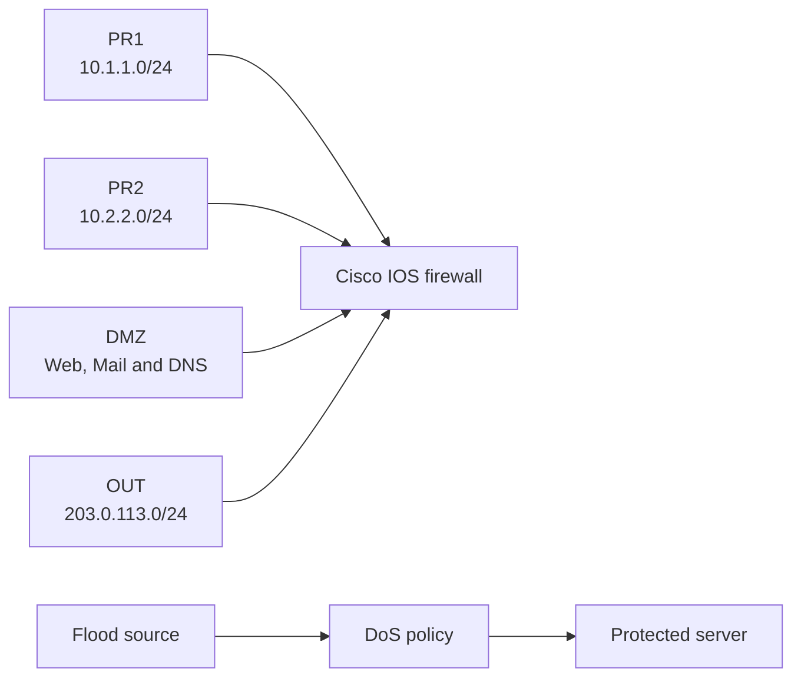

# Cisco ZBPF Firewall and Flood Mitigation


Cisco IOS Zone-Based Policy Firewall configurations for a segmented campus and a separate controlled flood-mitigation scenario.

> [!WARNING]
> Run flood-generation tools only in an isolated topology you own or are authorized to test.

## What it covers

- PR1, PR2, DMZ, OUT and firewall self zones.
- Stateful ZBPF policies built from ACLs, class maps, nested class maps, policy maps and zone pairs.
- NAT overload for private networks and controlled access to DMZ services.
- SSH administration through the self zone.
- ICMP and TCP SYN policing, plus a reduced TCP SYN wait time.

## Topology



The address plan and allowed service matrix are in [docs/ARCHITECTURE.md](docs/ARCHITECTURE.md).

## Layout

```text
configs/     campus and flood-mitigation Cisco IOS configurations
scripts/     configuration rendering helpers
docs/        topology notes
evidence/    selected console and packet summaries
```

## Requirements

- GNS3 with a Cisco IOS image that supports ZBPF.
- A campus topology with PR1, PR2, DMZ and OUT networks.
- An isolated attacker/protected-server pair for the policing scenario.

## Quick start

Render the campus configuration with a local administrator password, then load it on the firewall:

```bash
ADMIN_PASSWORD=... python3 scripts/render_config.py \
  configs/campus-zbpf.cfg.template campus-zbpf.cfg
```

Load `configs/dos-mitigation.cfg` only on the separate OUTSIDE/INSIDE test firewall.

## Verification

- PR1 and PR2 can use the permitted services towards OUT and DMZ.
- OUT can reach only the exposed DMZ services.
- Unrequested traffic towards PR networks is dropped.
- NAT translations appear for private-to-OUT flows.
- The flood policy increments its policing counters under controlled ICMP and TCP SYN traffic.

## Safety

Do not commit passwords, captures, IOS images, VM disks or local GNS3 project files. See [SECURITY.md](SECURITY.md).
