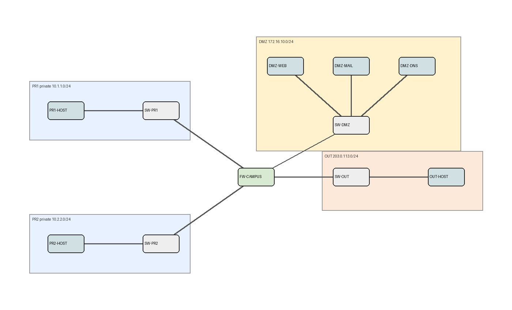
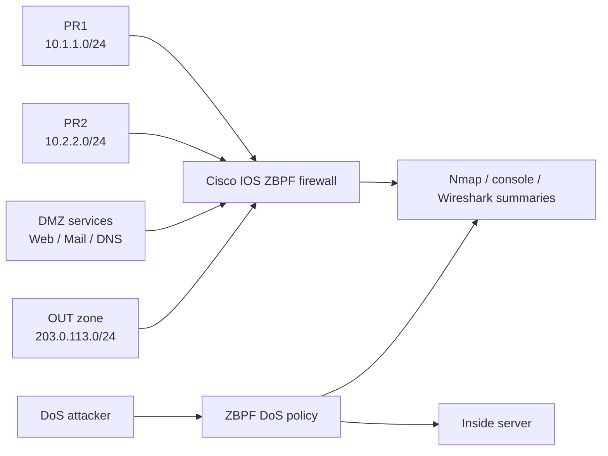

# Cisco ZBPF Firewall and DoS Mitigation Lab

A reproducible GNS3 network-security lab for Cisco Zone-Based Policy Firewall, campus segmentation, NAT, SSH-only firewall administration, and DoS mitigation evidence.

[](https://www.gns3.com/)
[](#academic-context)

[!WARNING]
This repository documents controlled academic network-security lab work. Run the commands and scenarios only in isolated environments where you have authorization. Licensed appliance images, course handouts, raw packet captures, and local lab state are intentionally excluded.

## Overview

This repository packages the SAAR Lab 1.2 firewall work as a portfolio-quality network-security lab. It documents a Cisco Zone-Based Policy Firewall deployment for a segmented campus network and a separate DoS mitigation scenario using inspection, policing, and TCP half-open session controls.

The repository is organized for public review: report source, architecture notes, selected evidence, CI-safe validation, and publication hygiene files are kept separate from generated or restricted lab artefacts.

## Academic Context

SAAR / Advanced Network Security and Architectures at Instituto Superior Tecnico. The lab focuses on Cisco IOS firewall policy design, validation with Nmap and packet captures, and defensible technical reporting.

## Key Features

- Campus topology with PR1, PR2, DMZ, OUT, and firewall self zones.
- Cisco ZBPF policy design using ACLs, class maps, nested class maps, policy maps, and zone pairs.
- NAT overload validation for private zones and controlled DMZ service exposure.
- SSH-only administrative access validation from all zones.
- ICMP flood and TCP SYN flood analysis with policing and TCP half-open mitigation.

## Architecture





See [docs/ARCHITECTURE.md](docs/ARCHITECTURE.md) for system boundaries, evidence flow, and publication caveats.

## Tech Stack

- GNS3
- Cisco IOS / Cisco 7200-style routing
- Zone-Based Policy Firewall
- Nmap
- Wireshark / tshark summaries
- PDF Report

## Repository Structure

```text
.
|-- docs/
|   |-- ARCHITECTURE.md
|   `-- report/
|-- evidence/
|-- scripts/
|-- CONTRIBUTING.md
|-- SECURITY.md
`-- README.md
```

- `docs/report/` - Final PDF report extract and selected figures.
- `docs/ARCHITECTURE.md` - Topology, evidence flow, and publication boundary.
- `evidence/` - Reviewed console outputs, Nmap results, screenshots, and capture summaries.

## Getting Started

Clone the repository and run the portable publication checks:

```powershell
```

Full lab reproduction requires a local GNS3 environment with the corresponding Cisco/Linux appliances and the original lab topology. Those resources are not redistributed here.

## Evidence Policy

Evidence under `evidence/` is curated and text-based where possible. Raw captures (`.pcap`, `.pcapng`), VM images, IOS/ASAv images, GNS3 project IDs, large generated artefacts, and private course PDFs are not included. The report references course material instead of vendoring it.

## Security and Ethics

This is an authorized educational network-security project. Do not target third-party systems, production networks, or public infrastructure. See [SECURITY.md](SECURITY.md) for scope and reporting guidance.

## Limitations

- Full reproduction requires GNS3 and Cisco-compatible lab appliances.
- Raw packet captures and licensed appliance images are intentionally not included.
- The repository documents lab validation rather than providing a one-command topology rebuild.

## Roadmap

- Add sanitized topology export metadata if redistribution is safe.
- Add optional scripts to regenerate selected text evidence from a running lab.
- Add rendered report build instructions for local LaTeX environments.

## Usage Note

This repository is published as an academic portfolio and reproducibility artefact for SAAR laboratory work. Course guides, network appliance images, and third-party materials may be subject to separate terms.

## References

- [Instituto Superior Tecnico](https://tecnico.ulisboa.pt/)
- [GNS3](https://www.gns3.com/)
- [Wireshark](https://www.wireshark.org/)
- Project-specific lab guides and course slides are cited inside the report source.

## Topics

cybersecurity, network-security, cisco, gns3, zbpf, firewall, dos-mitigation, nmap, wireshark, academic-project
